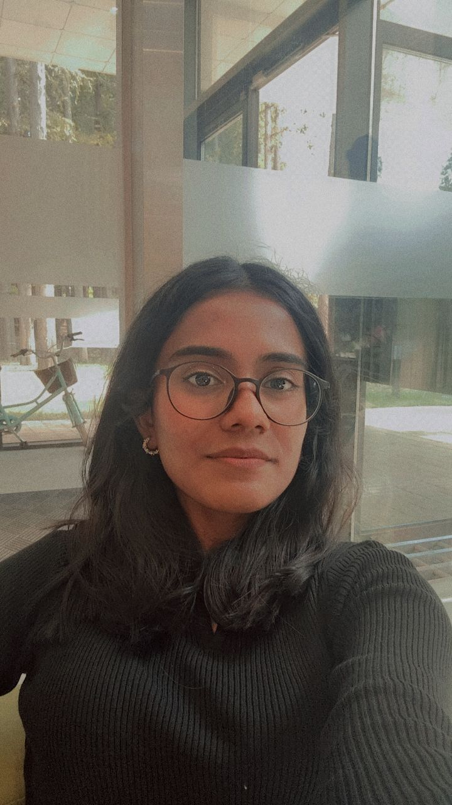

  <a href="#research-interests" style="margin-right:15px; text-decoration:none;">Research Interests</a>
  <a href="#education" style="margin-right:15px; text-decoration:none;">Education</a>
  <a href="#honors--awards" style="margin-right:15px; text-decoration:none;">Honors & Awards</a>
  <a href="#experience" style="margin-right:15px; text-decoration:none;">Experience</a>
  <a href="#courses--projects" style="margin-right:15px; text-decoration:none;">Courses & Projects</a>
  <a href="#skills" style="margin-right:15px; text-decoration:none;">Skills</a>
  <a href="#extracurricular-activities" style="margin-right:15px; text-decoration:none;">Extracurricular Activities</a>
  <a href="#hobbies" style="text-decoration:none;">Hobbies</a>

  
  

    <h1 style="margin-bottom: 5px;">Sarvina Satheskumar</h1>
    
<strong>Mobile:</strong> +82 10-2190-2563 
    <strong>Email:</strong> sarvinasatheskumar@yonsei.ac.kr 
    <strong>GitHub:</strong> <a href="https://github.com/Sarvina01">github.com/Sarvina01 
    <strong>Linkedin:</strong> www.linkedin.com/in/sarvina-satheskumar</a>

  

---

## Research Interests

I am interested in sustainable technologies and human-technology interaction, with a focus on biodegradable materials and safety systems for smart mobility. I am also curious about how innovation ecosystems and cross-cultural collaboration support the adoption of sustainable systems. I aim to contribute to research at the intersection of technology design, sustainability, and global impact.

---

## Education
**Yonsei University, Seoul, South Korea**  
Bachelor in Computer Science, Mar 2024 – Present

**Yonsei University Korean Language Institute, Seoul, South Korea**  
Korean Language Program, Intermediate Level 4; TOPIK Level 4, Mar 2023 – Feb 2024

**Selangor Matriculation College, Selangor, Malaysia**  
Physical Science Stream; GPA: 3.96 / 4.00, Sep 2021 – May 2022

---

## Honors & Awards
- Yonsei GLC Distinction Award (Spring 2024) – Excellence in “Christianity and World Culture”  
- Korean Government Scholarship Program (KGSP) 2023 – Only awardee chosen from 200 Malaysian applicants  
- Selangor Matriculation National Scholarship 2021–2022 – Awarded among 1488 pre-university students

---

## Experience
**Teacher Assistant, Yonsei International Summer School**  
*Jun 2025 – Aug 2025*  
- Supported entrepreneurship and venture capital courses for 2,400 students from 77 countries  
- Mentored cross-cultural student teams and facilitated group projects under Prof. Dongjeen Kim

**Startup Fellow, Yonsei University IBI**  
*Mar 2025 – Jun 2025*  
- Researched 6 biodegradable materials; benchmarked sustainability, scalability, and cost trade-offs  
- Modeled potential cost reductions by 30% through local sourcing and automation  
- Developed phased roadmap for market validation and prototype testing

**Project Manager, Yonsei-Nexon i RC Creative Platform**  
*Mar 2024 – Nov 2024*  
- Led 5-member team to develop school zone safety solutions for EV/hybrid drivers  
- Conducted expert interviews, technical research, and community awareness campaigns  
- Directed reporting, design, and promotion of competition deliverables

---

## Courses & Projects
**Biodegradable Packaging Study (IBI)**  
*Mar 2025 – Jun 2025*  
- Conducted market sizing (₩4.2T), sustainability benchmarking, and roadmap development

**EV School Zone Safety Solution**  
*Mar 2024 – Nov 2024*  
- Human-centered safety system for EV/hybrid drivers (Nexon Creative Platform 2024)

**Project Management Job Simulation**  
*Mar 2025*  
- CBRE – Forage: Planning, execution, and monitoring certificate program

---

## Skills
- **Languages:** English (fluent), Bahasa Melayu (fluent), Tamil (fluent), Korean (Intermediate)  
- **Programming:** Java, Python, C++, SQL  
- **Research & Analysis:** Market Analysis, Sustainability Benchmarking, Roadmap Design  
- **Management:** Team Leadership, Project Coordination, Mentoring  
- **Tools:** Microsoft Office, Figma, Canva

---

## Extracurricular Activities
**WeKids’ Yonsei Chapter – Junior Financial Executive**  
*Sep 2024 – Present*  
- Supported planning and execution of humanitarian aid campaigns  
- Contributed to financial planning and reporting to ensure successful campaigns

**Yonsei Foreign Student Union (FSU) – Deputy Head**  
*Mar 2024 – Dec 2024*  
- Organized orientation programs and events for freshmen at Yonsei International Campus  
- Planned and managed activities enhancing the student experience for foreign students  
- Served as Deputy Planning Head for Songdo Global Fair (Nov 2024)

**Iyagi Hour Yonsei – Korean-English Language Exchange Club**  
*Mar 2023 – Jun 2024*  
- Actively participated in exchange programs, fostering cross-cultural communication and language development  
- Represented UIC in Spring 2024, coordinating undergraduate–graduate collaboration

## Hobbies
- Reading Non-Fictions, Bullet Journaling, Streching & Yoga
